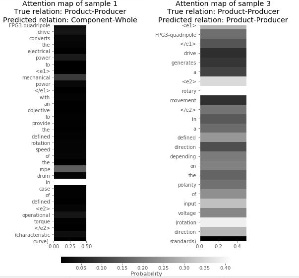

# Project Introduction
This project aims at recognizing company and domain specific named-entity and relations between the entities extracted from huge text data. The model forms a bases at building domain ontologies or company specific knowledge graphs. 

# Motivation 
In an automotive part manufacturing industry, there is possibility of product recalls due to a variety of reasons. Some of the reasons include internal or external part damage, mistakes in packaging process, poor internal management etc. However, identifying quality defects is often the most difficult and the most critical for the producer.

There are various problem solving process to handle product returns. A problem is defined as a deviation from a defined target situation, there are many ways to for problem solving and one such method of problem solving is 8D process, it defines 8 steps which includes not just solving the problem but also a root cause analysis so that the problem does not reoccur again and also a containment action to limit the problem and resume normal operations. However, each and every product already has an fmea(Failure mode and effect analysis document), an fmea pre-defines risk analysis, or the probable risk and failures a product can have, and there is a possiblity the the root cause might be defined in FMEA.

Since, most of it is in textual format and need domain expertise to search through an FMEA or perform a root cause analysis of the problem from scratch. Therefore, structuring of fmea contents can significantly improve the quality of 8D process and can also act as the basis for other applications.

A common approach for structuring of documents is to build a Named-entity recognition model for detecting the parts and subparts in each and every sentence of an fmea document. An addition to named entity recognition is also relationship extraction where we identify the 
relation of potential failure or function of the entity.

#### For example "Grease seals of motor interior."
In this case "Grease" is identified as an entity also "motor interior" is also an subpart of the motor. This has a cause effect relationship, which means "Grease" has a sealing effect on "motor Interior". Therefore, relation extraction task will extract,

Cause-effect(Grease,motor interior) Here, is an attempt to build an end-to-end entity and relationship extraction.
```python
# import pandas as pd
from lxml import etree
import xml.etree.ElementTree as ET
import csv

#data = "C:/Path/test.xml"

data = "C:/Users/akr2bue/pythonscript/mypythondata/bearingbolt.xml"
tree = ET.parse(data)
root = tree.getroot()
```
The FMEA is written in special software called IQRM, which consist of all the necessary fields to write the document. The first task was to export the FMEA into an XML file. Then the reference number for each of the failure sentence and the sentence itself was converted into a csv file.
The file was preprocess to include sentence, the 2 entities contained in the sentence and the relationship between the entities.

```python 
with open("fpg3_test_v2_2208.tsv") as f:
    test_file = f.readlines()
```
It is important to note that, initially an attempt was made to create ontology based on the sentences in fmea.
#### For example "FPG3-quadripole drive converts the electrical power to mechanical power with an objective to provide the defined rotation speed"
Here FPG3-quadripole drive is "entity 1" and "mechanical power" is "entity 2", the relation is that of a producer and a product. As mechanical power is generated from quadripole drive. Due, to lack of existing ontology an end-to-end model was defined such that both the entities and also the relationship between them needs to be extracted.

```python 

from itertools import islice
with open("fpg3_test_v2_2208.tsv") as myfile:
    head = list(islice(test_file, 5))
print(head)
```

```python
['1\t<e1> FPG3-quadripole </e1> drive converts the electrical power to <e2> mechanical power </e2> with an objective to provide the defined rotation speed of the rope drum in case of defined operational torque (characteristic curve).\tProduct-Producer\n', '3\tFPG3-quadripole drive converts the electrical power to <e1> mechanical power </e1> with an objective to provide the defined rotation speed of the rope drum in case of defined <e2> operational torque </e2> (characteristic curve).\tProduct-Producer\n', '4\tFPG3-quadripole drive converts the <e1> electrical power </e1> to mechanical power with an objective to provide the defined rotation speed of the rope drum in case of defined operational torque (characteristic curve).
```

Above shows sentence and relation between entities, Below we prepare sentences and relations training file.

```python 
def prepare_dataset_sen(raw_data):
    sentences = []
    for l in raw_data:
        sl = l.split("\t")
        if sl[0].isdigit():
            sent = sl[1]
            sentences.append(sent)
    print("Found {} sentences".format(len(sentences)))
    return sentences
 ```
 We prepare the sentences, with a list of entities given by domain experts and recognized using spacy. 
 
 ```python 
 
from __future__ import print_function, division
from keras.layers import Dense, LSTM, Dropout, Embedding, SpatialDropout1D, Bidirectional, concatenate, InputSpec

import os
import sys
import numpy as np
import pandas as pd
import regex as re
import pickle
import matplotlib.pyplot as plt
from keras import backend as K
```
Importing all the necessary packages

Now, we build the relation classification and attention layer of the model. 

```python 
class RelationClassifier(BaseEstimator, TransformerMixin):
    #class which takes raw input to perform relation classification 
    
    def __init__(self, maximum_words=30000, input_length=50, embedding_dim=50, n_rel=4):
        #defining input length, maximum word in vocabulary, embedding dimension for word vectors, and relations 
        self.max_words = maximum_words
        self.input_length = input_length
        self.emb_dim = embedding_dim
        self.n_classes = n_rel
        self.return_attention = True
        self.model = self._get_model()
        self.encoder = LabelEncoder()
        self.tokenizer = Tokenizer(num_words=self.max_words+1, filters='!"#$%&()*+,-.:;=?@[\\]^_`{|}~\t\n', lower=True, split=' ', oov_token="UNK")
    
    def _get_model(self):
        
        d = 0.5
        rd = 0.5
        rnn_units = 128
        raw_input_text = Input((self.input_length,)) # take raw input 
        # embedding layer with according to specified embedding dimensions  
        embedding_layer = Embedding(input_dim=self.max_words + 2, output_dim=self.emb_dim,
                                   input_length=self.input_length, mask_zero=True)(raw_input_text) 
        for_dropout = SpatialDropout1D(0.5)(embedding_layer)
        #bidirectional Long short term memory 
        bilstm_layer = Bidirectional(LSTM(units=rnn_units, return_sequences=True, dropout=d,
                                    recurrent_dropout=rd))(for_dropout)
        x_drop, attn = AttentionMech(return_attention=True)(bilstm_layer)
        x_drop = Dropout(0.5)(x_drop)
        # softmax activation as each sentence needs to be classified as one of the relations  
        out = Dense(units=self.n_classes, activation="softmax")(x_drop)
        model = Model(raw_input_text, out)
        return model
    
    def _get_attention_map(self, texts):
        attoutput_model = self.model.layers[0:-2]
        att_m = Model(attoutput_model[0].input, attoutput_model[-1].output)
        att_m.compile(optimizer=RMSprop(),
                          loss="sparse_categorical_crossentropy",
                          metrics=["accuracy"])
        return att_m.predict(self._get_sequences(texts))[1]
    
    def _get_sequences(self, texts):
        seqs = self.tokenizer.texts_to_sequences(texts)
        return pad_sequences(seqs, maxlen=self.input_length,
                             value=0, padding='post', truncating='post')
    
    def _labels(self, labels):
        return self.encoder.transform(labels)
    
    def fit(self, X, y, X_val=None, y_val=None, lr=0.001, resume=False,
            epochs=10, batch_size=32):

        self.model.compile(optimizer=RMSprop(clipnorm=10., lr=lr),
                           loss="sparse_categorical_crossentropy",
                           metrics=["accuracy"])
        
        if not resume:
            self.tokenizer.fit_on_texts(X)
            self.encoder.fit(y)
            self.tokenizer.word_index = {e: i for e,i in self.tokenizer.word_index.items() if i <= self.max_words}
            self.tokenizer.word_index[self.tokenizer.oov_token] = self.max_words + 1
        else:
            print("Resuming training...")
        seqs = self._get_sequences(X)
        categorical_y = self._labels(y)
        print("Fit text model with {} classes".format(len(self.encoder.classes_)))
        if X_val:
            val_seqs = self._get_sequences(X_val)
            categorical_y_val = self._labels(y_val)
            self.model.fit(seqs, categorical_y, batch_size=batch_size,
                           epochs=epochs, validation_data=(val_seqs, categorical_y_val))
        else:
            self.model.fit(seqs, categorical_y, batch_size=batch_size,
                           epochs=epochs, validation_split=0.1)
    
    def predict_proba(self, X, y=None):
        return self.model.predict(self._get_sequences(X))
    
    def predict(self, X, y=None):
        return np.argmax(self.predict_proba(X), axis=1)
    
    def save(self, path="model"):                               
        self.model.save_weights('{}_weights.h5'.format(path))          
        with open("{}_index.pkl".format(path), "wb") as f:                      
            pickle.dump([self.encoder, self.tokenizer, self.max_words,
                         self.emb_dim, self.input_length, self.n_classes], f)         
            
    def load(self, path="model"):                                                              
        with open("{}_index.pkl".format(path), "rb") as f:
            self.encoder, self.tokenizer, self.max_words, self.emb_dim, self.input_length, self.n_classes = pickle.load(f)                                                                     
        self.model = self._get_model()                                           
        self.model.load_weights('{}_weights.h5'.format(path))
```

Unique attention mechanism as proposed in following paper for relation classification [here.] (https://www.aclweb.org/anthology/P16-2034)

```python 
class AttentionMech(Layer):


    def __init__(self, return_attention=False, **kwargs):
        self.init = initializers.get('uniform')
        self.supports_masking = True
        self.return_attention = return_attention
        super(AttentionMech, self).__init__(** kwargs)

    def build(self, input_shape):
        self.input_spec = [InputSpec(ndim=3)]
        assert len(input_shape) == 3

        self.w = self.add_weight(shape=(input_shape[2], 1),
                                 name='{}_w'.format(self.name),
                                 initializer=self.init)
        self.trainable_weights = [self.w]
        super(AttentionMech, self).build(input_shape)

    def call(self, h, mask=None):
        h_shape = K.shape(h)
        d_w, T = h_shape[0], h_shape[1]
        
        logits = K.dot(h, self.w)  # w^T h
        logits = K.reshape(logits, (d_w, T))
        alpha = K.exp(logits - K.max(logits, axis=-1, keepdims=True))  # exp
        
        
        if mask is not None:
            mask = K.cast(mask, K.floatx())
            alpha = alpha * mask
        alpha = alpha / K.sum(alpha, axis=1, keepdims=True) # softmax
        r = K.sum(h * K.expand_dims(alpha), axis=1)  # r = h*alpha^T
        h_star = K.tanh(r)  # h^* = tanh(r)
        if self.return_attention:
            return [h_star, alpha]
        return h_star

    def get_output_shape_for(self, input_shape):
        return self.compute_output_shape(input_shape)

    def compute_output_shape(self, input_shape):
        output_len = input_shape[2]
        if self.return_attention:
            return [(input_shape[0], output_len), (input_shape[0], input_shape[1])]
        return (input_shape[0], output_len)

    def compute_mask(self, input, input_mask=None):
        if isinstance(input_mask, list):
            return [None] * len(input_mask)
        else:
            return None
  ```
  ```python 
  rclf = RelationClassifier(input_length=50, n_rel=n_relations, maximum_words=15000)
  ```
  
  We then fit data on the model. 
  
  ```python
 
rclf.fit(X=train_sent, y=train_rel, X_val=test_sent, y_val=test_rel,
         batch_size=2, lr=0.001, epochs=30)
  ```
  
  We then check how well it has performed on the test dataset and the probabilities of attention. 
  ```python 
  
y_pred = rclf.predict(test_sent)
y_attn = rclf._get_attention_map(test_sent)


i = 1
activation_map = np.expand_dims(y_attn[i][:len(test_sent[i].split())], axis=1)

f = plt.figure(figsize=(8, 8))
ax = f.add_subplot(1, 1, 1)

img = ax.imshow(activation_map, interpolation='none', cmap='gray')

plt.xlim([0,0.5])
ax.set_aspect(0.1)
ax.set_yticks(range(len(test_sent[i].split())))
ax.set_yticklabels(test_sent[i].split());
ax.grid()
plt.title("Attention map of sample {}\nTrue relation: {}\nPredicted relation: {}"
          .format(i, test_rel[i], rclf.encoder.classes_[y_pred[i]]));

# add colorbar
cbaxes = f.add_axes([0.2, 0, 0.6, 0.03]);
cbar = f.colorbar(img, cax=cbaxes, orientation='horizontal');
cbar.ax.set_xlabel('Probability', labelpad=2);
  ```



# Conclusion 
The work of this thesis performs semantic relation extraction between entities from FMEA document. This aims to serve as the basis for company-specific I4.0 knowledge graph creation. FMEA is an analytical method of preventive quality management conducted during the development of product and process in the manufacturing industry. FMEA is a critical document, allowing organizations to anticipate failures during the design stage of a product and process. A poorly designed FMEA can result in product recalls from customers and high costs to the organization. 
Since this document can be of tremendous help to the organization it was used as a starting point for the creation of semantic data integration. Entities and semantic relation between the entities need to be extracted from the document to create the semantic information model. Semantic data integration is a potential solution to reduce prepossessing time spend in data analytics due to a large number of heterogeneous data produced within the organization. 
The data contained within the FMEA is highly company and domain-specific, therefore generic libraries used for information extraction tasks such as named entity recognition and relation extraction cannot be used directly to identify entities and relations. Therefore, initially, an attempt was made to create a domain-specific ontology which specifies entities and relations within the company domain. However, domain ontology requires huge amount of domain expertise. Therefore, SemEval-2010 Task 8 was used as a training dataset to extract relations between domain-specific entities. A small test dataset was created by domain experts from the industry to test the accuracy on the FMEA documents. Since the entities are company-specific and also lacking domain lexicons to identify the entities, it was labelled manually during the creation of test dataset. 
The thesis uses an attention-based BiLSTM, and CNN model to extract semantic relations between the selected entities in the test dataset. The attention BiLSTM model achieves an f1-score of 0.66 on the relation extraction task. Total accuracy achieved on training dataset is 94\% and test dataset is 61\%. The CNN model achieves an f1-score of 0.42. The total accuracy achieved for the CNN model on training data is 96\% and on the test dataset of 42\%. The high domain-specific data caused certain limitations to the results however, several methods are proposed in the future work that can be explored to improve the results significantly in the system. 
